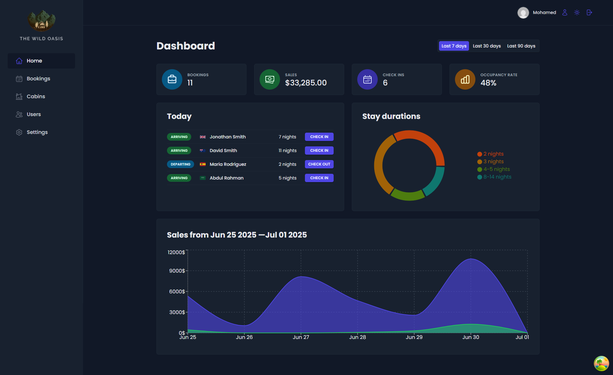
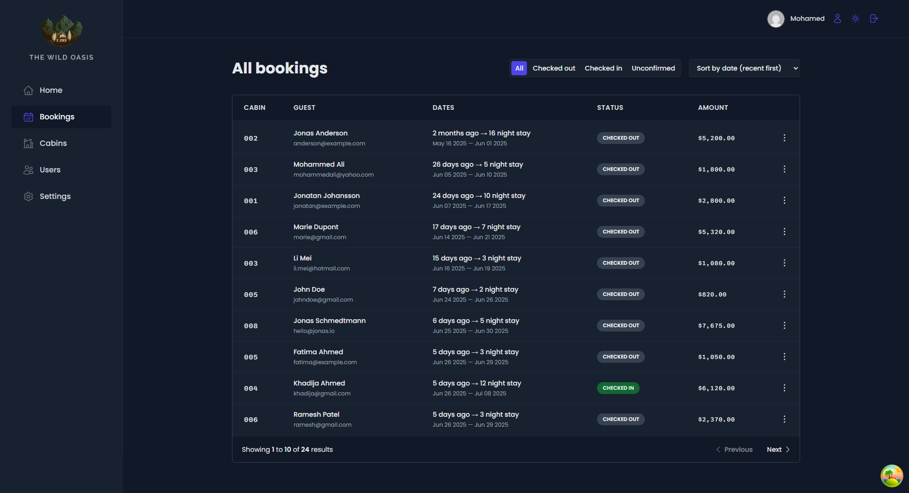
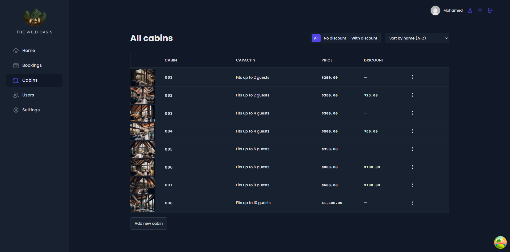

# 🏡 The Wild Oasis


A comprehensive hotel management application for The Wild Oasis boutique hotel. This internal application helps staff manage cabins, bookings, and guests while providing insightful statistics through a powerful dashboard.

## 🔗 Links

- [Live Demo](https://the-wild-oasis-mo3bassia.vercel.app)
- [GitHub Repository](https://github.com/mo3bassia/the-wild-oasis)
- [My Portfolio](https://mo3bassia-next-portfolio.vercel.app/)

## ✨ Features

### 📊 Dashboard

- **Statistics Overview**: Bookings, sales, check-ins, and occupancy rate
- **Today's Activity**: Quick view of check-ins and check-outs for the day
- **Charts and Graphs**: Sales and booking duration visualization
- **Filterable Time Periods**: View data for different time ranges

### 🏠 Cabin Management

- **Cabin Overview**: List all cabins with details and images
- **Create/Edit Cabins**: Add new cabins or modify existing ones
- **Delete Cabins**: Remove cabins from the system
- **Duplicate Cabins**: Quickly create similar cabin listings
- **Filtering & Sorting**: Organize cabins by various criteria

### 📅 Booking Management

- **Booking List**: View all bookings with filtering and sorting options
- **Booking Details**: Comprehensive view of each booking
- **Check-in & Check-out**: Process guest arrivals and departures
- **Delete Bookings**: Remove bookings from the system
- **Add Breakfast Option**: Modify bookings to include breakfast service

### 👥 User Management

- **User Authentication**: Secure login system
- **User Registration**: Create new staff accounts
- **User Profile**: Update personal information and avatar
- **Password Management**: Secure password update functionality

### ⚙️ Settings

- **Hotel Settings**: Configure booking-related settings
- **Minimum/Maximum Nights**: Set stay duration limits
- **Maximum Guests**: Define guest capacity limits
- **Breakfast Price**: Set the price for breakfast service

### 🎨 UI/UX Features

- **Dark/Light Mode**: Toggle between color themes
- **Responsive Design**: Works on desktop and mobile devices
- **Toast Notifications**: User-friendly feedback messages
- **Confirmation Dialogs**: Prevent accidental data modifications
- **Form Validation**: Ensure correct data entry
- **Optimistic UI Updates**: Immediate feedback for user actions
- **Error Handling**: Graceful error management with fallbacks

## 🛠️ Tech Stack

### Frontend

- **React 19**: Modern UI library for building user interfaces
- **React Router 7**: For declarative routing in the application
- **Styled Components**: CSS-in-JS for component styling
- **React Query (TanStack Query)**: Data fetching and state management
- **React Hook Form**: Form validation and handling
- **Recharts**: Flexible charting library for data visualization
- **React Icons**: Comprehensive icon library
- **React Hot Toast**: Toast notifications
- **React Error Boundary**: Graceful error handling
- **Date-fns**: Date utility library

### Backend & Data

- **Supabase**: Backend-as-a-Service
  - Authentication & User Management
  - PostgreSQL Database
  - Storage for images
  - Row-Level Security

### Development & Build Tools

- **Vite**: Fast build tool and development server
- **ESLint**: Code quality and consistency
- **React Query Devtools**: Debug React Query state
- **React Strict Mode**: Highlight potential problems

## 📸 Screenshots





## 🚀 Getting Started

### Prerequisites

- Node.js (v16+)
- npm or yarn

### Installation

1. Clone the repository

```bash
git clone https://github.com/Mo3bassia/the-wild-oasis.git
cd the-wild-oasis
```

2. Install dependencies

```bash
npm install
# or
yarn
```

3. Start the development server

```bash
npm run dev
# or
yarn dev
```

4. Open your browser and navigate to `http://localhost:5173`

### Building for Production

```bash
npm run build
# or
yarn build
```

## 🧰 Project Structure

```
the-wild-oasis/
├── public/                  # Static assets
│   ├── images/              # Image assets
│   └── favicon.ico          # Favicon
├── src/
│   ├── components/          # Shared components
│   ├── features/            # Feature-specific components
│   ├── hooks/               # Custom hooks
│   ├── pages/               # Page components
│   ├── styles/              # Global styles
│   ├── utils/               # Utility functions
│   └── App.jsx              # Main app component
├── .env                     # Environment variables
├── .gitignore               # Git ignore file
├── package.json             # Package configuration
└── vite.config.js          # Vite configuration
```

## 🤝 Contributing

We welcome contributions to enhance the Wild Oasis project. To get started:

1. **Fork the Repository**: Click on the "Fork" button at the top right of this page.
2. **Clone Your Fork**: Clone your forked repository to your local machine.
3. **Create a Branch**: Create a new branch for your feature or bugfix.
4. **Make Changes**: Implement your changes and test them thoroughly.
5. **Commit and Push**: Commit your changes and push them to your forked repository.
6. **Open a Pull Request**: Navigate to the original repository and open a pull request.

Please ensure your code adheres to the project's coding standards and includes appropriate tests.

## 🌱 Ongoing Journey

The Wild Oasis project is a continuous journey of learning and improvement. As the project evolves, we aim to incorporate more features, improve performance, and enhance the overall user experience. Stay tuned for more updates, and feel free to reach out if you have any suggestions or feedback!

## 📜 License

This project is licensed under the MIT License.
